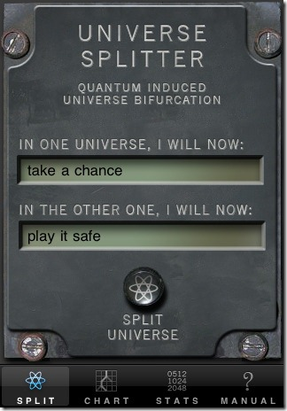
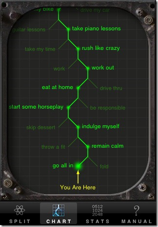

# Playing Dice with the Universe

This is the eleventh in the fourteen part series:

* [Scheme in F#](Docs/intro.md)
* [Just 'let' Me Be!](let.md)
* [Lambda the Ultimate!](lambda.md)
* [Rinse and Recurse](recurse.md)
* [What 'letrec' Can't Do](letstar.md)
* [What's Lisp Without Lists?!](lists.md)
* [No Wait, Macro the Ultimate!](macros.md)
* [Oh, The Humanity!](mutation.md)
* [Language vs. Library](library.md)
* [Turning Your Brain Inside Out With Continuations](continuations.md)
* Playing Dice with the Universe
* [Functional I/O (or at least "O")](functional_o.md)
* [Functional I/O (including "I" this time)](functional_i.md)
* [Historical Debugging](debugging.md)

We’re now taking the first small step into the world of nondeterministic logic programming (chapter 16 of [Bill Hails’ book](http://billhails.net/Book/)). Hopefully you enjoyed the [last post about continuation passing](continuations.md) and found the idea to be ripe with potential power; indeed so powerful that we’re going to use it now to bifurcate the universe! No really, we are…




There is a funny [app for the iPhone](http://itunes.apple.com/WebObjects/MZStore.woa/wa/viewSoftware?id=329233299&mt=8) that illustrates the [Many-worlds Interpretation](http://en.wikipedia.org/wiki/Many-worlds_interpretation) of quantum mechanics. It’s really just a super-glorified coin toss app in which every time you’re ambivalent about a decision, you simply choose both; split into parallel universes and carry on with your life(s)?

# What Might Have Been

We're not going to go as far as to spin up multiple threads to simulate parallel universes (although that might be fun to try!). The big idea is to use continuations to do chronological backtracking. We’re going to add to FScheme an ambivalent operator (`amb` for short). Here’s an example of how it will work:

``` scheme
> (amb "take a chance" "play it safe") 
take a chance
```

See what we did there? We had mixed feelings about what to do so we told the interpreter to do both. It chose for us. If we don’t like that resulting universe, we can go back in time and try the other option by issuing a special backtracking command (`?`):

``` scheme
> ? 
play it safe 
```

Once we’ve exhausted our options the interpreter tells us:

``` scheme
> ? 
No more solutions.
```

The options are chosen in a deterministic way, but simply looking at the `(amb …)` expression alone is not enough to determine its value.

This works with more complicated sets of options; any expressions we like:

``` scheme
> (amb (* 3 5) (- 50 8)) 
15 
> ? 
42 
> ? 
No more solutions.
```

It also works embedded within other expressions:

``` scheme
> (* 2 (amb 3 4)) 
6 
> ? 
8 
> ? 
No more solutions.
```

And you can have multiple ambivalent values within expressions:

``` scheme
> (list (amb 1 2) (amb 'a 'b)) 
(1 a) 
> ? 
(1 b) 
> ? 
(2 a) 
> ? 
(2 b) 
> ? 
No more solutions.
```

## Behind the Magic

Below is all there is to the magic. The heart of the idea is to realize (as we [discovered in the last post](continuations.md)) that continuations represent nice bundles of complete execution state and can be stored away to be resumed at will. Every time we’re forced to make an arbitrary choice, we store away a snapshot of the universe so we can come back and change our minds later if we wish.

``` fsharp
let mutable backtrack = [] // ambivalent back stack
and Ambivalent cont env args = 
    match args with 
    | choice :: t –> 
        backtrack <- (fun () -> Ambivalent cont env t) :: backtrack 
        eval cont env choice 
    | [] –> 
        match backtrack with 
        | back :: t -> backtrack <- t; back () 
        | [] -> printfn "No more solutions."; Dummy("Unsolvable") |> cont
```

Whenever we’re asked to produce an ambivalent result, we first take the current continuation and push a recursive ‘amb’ call onto a backtrack stack and then yield the first choice. This backtrack stack is the key to it all. It represents all the points in the execution at which we made an arbitrary choice; all the points at which we split the universe. The continuation, along with the remaining list of choices, is enough information to later come back and choose a different parallel universe any time we like!

If ever we’re asked to yield a choice from an empty list of options then we abandon the current continuation (just don’t call it) and force a backtrack. Additionally, we allow forcing a backtrack from the REPL by typing “?”:

``` fsharp
let rep env = 
    let eval' = function 
        | Symbol("?") –> 
            match backtrack with 
            | h :: t -> backtrack <- t; h () 
            | [] -> printfn "No current problem."; Dummy("No problem") 
        | e -> eval id env e 
    List.ofSeq >> parse >> List.head >> eval' >> print
```

[Note: In the book, a more complicated (though perhaps more elegant) approach is used in which an additional backtrack continuation is threaded through the whole works. I chose this simpler, less invasive, but impure method of maintaining a mutable stack.]

## Truly Declarative Programming

There is a lot of recent talk about declarative languages; letting you declare what to do and allowing the runtime to decide exactly how. Functional programming is generally more declarative than imperative programming but, for the extreme end of the spectrum, a language like Prolog is most fascinating. Logic programming is a whole paradigm in which I’ve been interested for quite some time but I must admit I’ve only dabbled. Just last week in fact, I borrowed The Art of Prolog from a coworker’s bookshelf and am working my way through. It will take some time before I’m ready to blog about it, but here I want to whet your appetite with just a small peek.

It might look a little tricky, but remember that evaluating ‘amb’ against an empty set of choices forces a backtrack. So we can define a function that backtracks when a particular condition isn’t met:

``` scheme
(define require (lambda (e) (if e e (amb))))
```

Then watch this:

``` scheme
> (define odd? (lambda (x) (% x 2))) 
> (define even? (lambda (x) (not? (odd? x)))) 
> (let ((x (amb 1 2 3 4 5 6 7 8 9))) (begin (require (even? x)) x)) 
2 
> ? 
4 
> ? 
6 
> ? 
8 
> ? 
No more solutions.
```

We yield only choices meeting the required condition. In general, we can think of this style of declarative programming as:

1. Define the range of inputs 
2. Define what a “solution” looks like 
3. Let the machine find solutions for you

Let’s try it with a little more complicated problem; finding Pythagorean Triples. These are sets of three positive integers (a, b and c) satisfying the equation a^2 + b^2 = c^2. For example 3^2 + 4^2 = 5^2. Here’s the solution (or rather, what solutions in general look like and the definition of input ranges – we won’t search all positive integers):

``` scheme
(define square (lambda (x) (* x x)))

(define pythagorean-triples (lambda () (let ( 
    (a (amb 1 2 3 4 5 6 7 8 9 10)) 
    (b (amb 1 2 3 4 5 6 7 8 9 10)) 
    (c (amb 1 2 3 4 5 6 7 8 9 10))) 
    (begin 
        (require (= (+ (square a) (square b)) (square c))) 
        '((a ,a) (b ,b) (c ,c))))))
```

Really, look we didn’t say anything other than to declare the ranges for `a`, `b` and `c` and to `require` they satisfy the Pythagorean theorem. That’s all we have to do. The interpreter does the rest:

``` scheme
> (pythagorean-triples) 
((a 3) (b 4) (c 5)) 
> ? 
((a 4) (b 3) (c 5)) 
> ? 
((a 6) (b 8) (c 10)) 
> ? 
((a 8) (b 6) (c 10)) 
> ?
```

Pretty sweet!

[Note: In the book Bill Hails goes further and rewrites the imperative `define` and `set!` to undo their state changes upon backtracking. We haven't done that, so beware the pitfalls...]

## Next: [Functional I/O (or at least "O")](functional_o.md)
