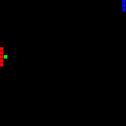

# Functional I/O (including “I” this time)

This is the thirteen in the fourteen part series:

* [Scheme in F#](Docs/intro.md)
* [Just 'let' Me Be!](let.md)
* [Lambda the Ultimate!](lambda.md)
* [Rinse and Recurse](recurse.md)
* [What 'letrec' Can't Do](letstar.md)
* [What's Lisp Without Lists?!](lists.md)
* [No Wait, Macro the Ultimate!](macros.md)
* [Oh, The Humanity!](mutation.md)
* [Language vs. Library](library.md)
* [Turning Your Brain Inside Out With Continuations](continuations.md)
* [Playing Dice with the Universe](amb.md)
* [Functional I/O (or at least "O")](functional_o.md)
* Functional I/O (including "I" this time
* [Historical Debugging](debugging.md)

Now to add input to our Functional I/O system; following up on the [previous post](functional_o.md). We already had bouncing balls so how ‘bout we add a mouse-controlled paddle and make a primitive “Pong”?

## Mouse Input

To keep it simple, we’re just going to add mouse position as input; including the current mouse x/y in the world state passed in on each iteration. We could add any other input we like this way: network responses, key events, etc. One issue we’re avoiding is handling events such as key/button down/up without missing them due to our `tick` sample rate - instead having to queue them and play catch up (losing time instead). Here we keep it pretty ridiculously easy (notice the addition of `f.MouseMove.Add(...)`:

``` fsharp
let mouseX = ref 0 
let mouseY = ref 0 
let events () = List([Number(bigint mouseX.Value); Number(bigint mouseY.Value)]) 

let eval' name = eval id environment (List([Symbol(name); List([Symbol("quote"); List([world.Value; events ()])])])) 

let form () =
    let f = new Form(Text = "Canvas", Width = w * s + 16 - 1, Height = h * s + 38 - 1, Visible = true)
    f.Paint.Add(fun a -> a.Graphics.DrawImage(paint (), 0, 0)) 
    f.MouseMove.Add(fun a -> mouseX := a.X / s; mouseY := a.Y / s) 
    let loop () = while true do world := eval' "tick"; f.Refresh(); System.Threading.Thread.Sleep(33) 
    (new System.Threading.Thread(new System.Threading.ThreadStart(loop))).Start() 
    f
```

The last known mouse position is passed in on each tick. Again here we’re maintaining mutable state in the runtime but Scheme programs running within this system are expressed as pure functions of the input state.

## An Old Classic

With the bouncing balls from before, Pong is the first interactive game that comes to mind. The left paddle will be the computer and follow the ball’s y position (you can’t win!). The right paddle is to be the player and is contolled by the mouse’s y.

``` scheme
(define pongworld (lambda (fn world) 
    (let ((ball (car world)) 
          (mouse (cadr world))) 
        (fn (car ball) (cadr ball) ; position x/y 
            (caddr ball) (cadddr ball) ; delta x/y 
            (cadr mouse))))) ; paddle position y

(define bounce (lambda (i di) 
    (if (or (and (> di 0) (> i 30)) ; heading toward right/bottom and off edge 
        (and (> 0 di) (> 1 i))) ; or heading toward left/top and off edge 
            (- di) di))) ; reverse direction

(define paddle (lambda (x y color) (map 
    (lambda (d) '((,x ,(+ y d)) ,color)) 
    '(-2 -1 0 1 2))))

(define init (lambda (_) '(1 14 1 1)))

(define tick (lambda (world) 
    (pongworld (lambda (x y dx dy p) 
        (if (and (> x 30) ; off player's edge? 
            (or (< (+ y 3) p) (> (- y 3) p))) ; not hitting paddle? 
        (init '()) ; reset, else move ball as usual... 
        '(,(+ x dx) ,(+ y dy) ; increment position 
        ,(bounce x dx) ,(bounce y dy) ; bounce off edges 
    ))) world)))

(define draw (lambda (world) 
    (let ((red '(255 0 0)) 
          (green '(0 255 0)) 
          (blue '(0 0 255))) 
        (pongworld (lambda (x y _ _ p) (cat (cat 
            '(((,x ,y) ,green)) ; ball 
            (paddle 0 y red)) ; computer's paddle 
            (paddle 31 p blue) ; player's paddle 
        )) world))))
```

Give it a try:

``` scheme
> (load "pong.scm") 
Loaded 'pong.scm'. 
> (run)
```



## The Beauty of FRP

The real beauty of this FRP-ish system isn’t that we can write a cheesy Pong in 30 lines of Scheme. The beauty is that those 30 lines are absolutely pure! There is no mutation or side effects being used and yet we’re obviously maintaining state over time (ball position and vector). Unlike normal I/O APIs there are no impure zero-argument functions returning different things each time called (e.g. `Console.ReadLine`) or taking arguments and returning nothing (e.g. `Console.WriteLine`). The visual rendering is a pure function of the current world state instead of a sequence of mutations to a graphics context.

It’s all expressed as a set of pure functions with no direct notion of time or state. Beautiful!

## Next: [Historical Debugging](debugging.md)
