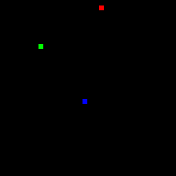

# Functional I/O (or at least “O”)

This is the twelth in the fourteen part series:

* [Scheme in F#](Docs/intro.md)
* [Just 'let' Me Be!](let.md)
* [Lambda the Ultimate!](lambda.md)
* [Rinse and Recurse](recurse.md)
* [What 'letrec' Can't Do](letstar.md)
* [What's Lisp Without Lists?!](lists.md)
* [No Wait, Macro the Ultimate!](macros.md)
* [Oh, The Humanity!](mutation.md)
* [Language vs. Library](library.md)
* [Turning Your Brain Inside Out With Continuations](continuations.md)
* [Playing Dice with the Universe](amb.md)
* Functional I/O (or at least "O")
* [Functional I/O (including "I" this time)](functional_i.md)
* [Historical Debugging](debugging.md)

I just watched [Matthias Felleisen’s talk](http://vimeo.com/6631514) on Functional I/O and read [this paper](http://delivery.acm.org/10.1145/1600000/1596561/p47-felleisen.pdf?key1=1596561&key2=4733387621&coll=GUIDE&dl=GUIDE&CFID=73785769&CFTOKEN=48695734) and decided to bolt on a little I/O system to the FScheme interpreter we’ve been building. It’s a pretty nice FRP-type system. Reading the paper or watching the talk is well worth the time.

## Pure Functional Simulation

The basic idea is to run a simulation by iterating a pure function from world state to world state. We’ll add a new `run` primitive which will expect several user-defined functions to have been set up. The world state is initially produced by an `init` function. Then every 30th of a second a `tick` function is called to produce a new world state from the current state. Finally a `draw` function will be called to render the world.

The world state doesn’t include any user input (mouse, keys, etc.), so I guess for now we’re not really handling “I/O” but just “O”. We could choose anything we like to represent the output state. It could be a set of 2D drawing primitives or a 3D model. It could include sounds to be played, network requests to be sent out, etc. For simplicity, here we’ll consider output to be a simple list of colored pixels. For example, a single red pixel at 10,15 would be: `((10 15) (255 0 0))` – the x/y coordinates and red/green/blue values. Output will be a list of such pixels which will be rendered on a 32x32 grid.

To the programmer working within our system there is no state; only pure functions. But in the underlying runtime we’ll be maintaining the world and passing it into evaluated user-defined functions:

``` fsharp
let world = ref (Symbol("Dummy world")) 
let eval' name = eval id environment (List([Symbol(name); List([Symbol("quote"); world.Value])]))
```

We’ll expect a `draw` function to be defined which will return a list of pixels to be rendered. We’ll call this and paint to a bitmap:

``` fsharp
let w = 32 
let h = 32 
let s = 8 // pixel size 
let bmp = new Bitmap(w * s, h * s) 
let paint () = 
    use gc = Graphics.FromImage(bmp) 
    gc.Clear(Color.Black) |> ignore 
    match eval' "draw" with 
    | List(pixels) –> 
        let fill = function 
        | List([List([Number(x); Number(y)]); List([Number(r); Number(g); Number(b)])]) –> 
            gc.FillRectangle(new SolidBrush(Color.FromArgb(0xFF, int r, int g, int b)), int x * s, int y * s, s - 1, s - 1) 
        | _ –> () 
        List.iter fill pixels 
    | _ -> failwith "Malformed graphical output." 
    bmp
```

The above ‘paint’ function asks ‘draw’ to produce a list of pixels which are painted as little filled rectangles. This ‘paint’ will be used to render a plain ol’ WinForms app:

``` fsharp
type Form() = 
    inherit System.Windows.Forms.Form() 
    override x.OnPaintBackground _ = () // no flicker 
let form () = 
    let f = new Form(Text = "Canvas", Width = w * s + 16 - 1, Height = h * s + 38 - 1, Visible = true) 
    f.Paint.Add(fun a -> a.Graphics.DrawImage(paint (), 0, 0)) 
    let loop () = while true do world := eval' "tick"; f.Refresh(); System.Threading.Thread.Sleep(33) 
    (new System.Threading.Thread(new System.Threading.ThreadStart(loop))).Start() 
    f
```

This form will eval the user-defined ‘tick’ function repeatedly and refresh (calling ‘paint’ from above). That’s about all there is to running a simulation. We’ll just define a simple ‘run’ function to initialize the world and to kick off this form:

``` fsharp
let run cont _ = 
    world := eval' "init" 
    Application.Run(form ()); Dummy("Dummy 'run'.") |> cont
```

This is all the code for our little micro world simulation. Pretty dang simple really!

## What Can We Do With It?

Here’s a sample balls.scm simulating several balls bouncing around on the screen:

``` scheme
(define ballworld (lambda (fn world) 
    (let ((ball (car world)) 
          (color (cadr world)))
         (fn (car ball) (cadr ball) ; position x/y 
             (caddr ball) (cadddr ball) ; delta x/y 
             (car color) (cadr color) (caddr color))))) ; red/green/blue 

(define bounce (lambda (i di) 
    (if (or (and (> di 0) (> i 31)) ; heading toward right/bottom and off edge 
            (and (> 0 di) (> 0 i))) ; or heading toward left/top and off edge 
        (- di) di))) ; reverse direction

(define ballmove (lambda (ball) 
    (ballworld (lambda (x y dx dy r g b) '(( 
        ,(+ x dx) ,(+ y dy) ; increment position 
        ,(bounce x dx) ,(bounce y dy)) ; bounce off edges 
        (,r ,g ,b))) ball))) ; color unchanged

(define balldraw (lambda (ball) 
    (ballworld (lambda (x y dx dy r g b) 
        '((,x ,y) (,r ,g ,b))) ball))) ; simply draw as single pixel at x/y position

(define red '(255 0 0)) 
(define green '(0 255 0)) 
(define blue '(0 0 255))

(define init (lambda (_) 
    '(((16 0 2 1) ,red) 
    ((6 9 1 -1) ,green) 
    ((16 16 -1 2) ,blue)))) 
(define tick (lambda (input) (map ballmove input))) 
(define draw (lambda (world) (map balldraw world)))
```

Ultimately the last three functions (‘init’, ‘tick’ and ‘draw’) represent the simulation. The ‘init’ will be called to create our world which consists of three different colored balls having various starting x/y positions and dx/dy motion deltas. The ‘tick’ function will produce a new world by moving the balls (mapping ‘ballmove’ over the three of them). Finally ‘draw’ will render this world to a list of pixels to be painted. The code’s pretty straight forward with maybe the exception of the ‘ballworld’ function which is used to unpack the world state with a bunch of ugly car/cadr/caddr/cadddr list accessors and pass as a cleaner set of parameters to a given function. To try it out, just load and run:

``` scheme
> (load "Balls.scm") 
Loaded 'Balls.scm'. 
> (run)
```

And voila!



## What About Input?

In the [next post](funcional_i.md) we add the “I” of I/O.

## Next: [Functional I/O (including "I" this time)](functional_i.md)
